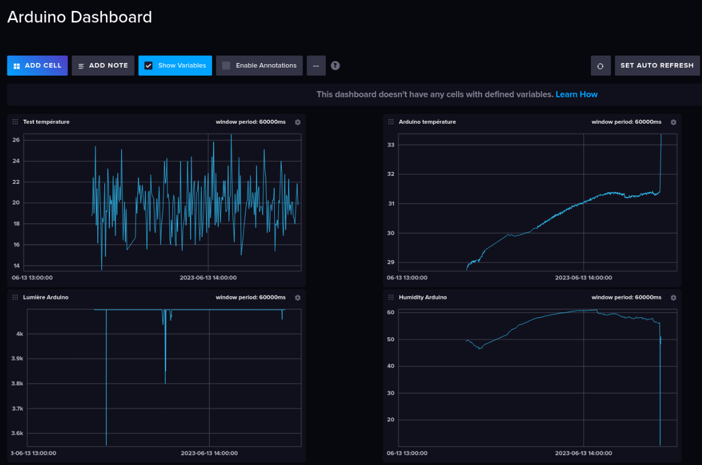

---
title: "IoT - Projet Serre connectée"
subtitle: "Rapport et documentation"
author: 
- Anthony Coke
- Guilain Mbayo
- Mehdi Salhi
date : \today
titlepage: true
logo: figures/logo.png
toc: true
toc-own-page: true
...

# Projet

Ce projet permet de réaliser une serre connectée. Il utilise des composants
Arduino pour prendre les mesures et Raspberry pour ingérer et afficher les
données. Il est possible d'y ajouter des appareils avec senseurs et actuateurs
variés qui s'inscriront et publieront automatiquement sur un broker MQTT afin
d'envoyer leur configuration (ID, liste de senseurs et actuateurs, intervalle de
mesure) ainsi que leurs mesures.

L'objectif de ce projet est de pouvoir surveiller les données environnementales
d'une serre telles que la température, l'humidité du sol et de l'air, la
luminosité ainsi que d'activer des actuateurs tels qu'un ventilateur par
exemple.

# Code

Le code est accessible sur le GitHub du projet: <https://github.com/MehSalhi/IOT-Project/>

# Matériel

Nous utilisons le matériel suivant: 

- Arduino MKR Wifi 1010 : exécution du code et connectique wifi
- Arduino MKR IOT Carrier : senseurs et actuateurs
- Raspberry Pi 4b : broker MQTT, base de donnée InfluxDB, interface web de
  gestion et configuration des appareils

## Senseurs

Nous utilisons les senseurs suivants qui permettent de prendre des mesures :

- Arduino MKR IOT Carrier
    - température : HTS221
    - humidité : HTS221
    - lumière : APDS-9960
- humidité du sol : Capacitive Soil Moisture Sensor v1.2
    - connecté à l'Arduino MRK IOT Carrier

## Actuateurs

Nous utilisons un actuateur : 

- ventilateur : Xilence XPF40.W DC12v 0.05A
    - le ventilateur est connecté à un transistor MOSFET qui permet de contrôler
      son alimentation via un signal envoyé depuis l'Arduino MKR Wifi 1010. Le
      MOSFET utilisé est un `BF 256b` (documentation: <https://www.mouser.com/datasheet/2/149/bf256b-292516.pdf>)

{width=40%}

{width=40%}

# Logiciel

Les logiciels suivants sont utilisés :

- InfluxDB 2.71 : base de données pour séries temporelles
- Telegraf 1.26.3 : ingestion des données au format `line protocol` depuis le 
    broker MQTT vers la base de
  donnée InfluxDB
- Mosquitto 2.0.11-1 : broker MQTT
- Arduino : code arduino pour récupérer les mesures et communiquer avec le
  broker MQTT
- NodeJS 16.17.1 : serveur web d'administration
    - dépendances :
        - influxdata/influxdb-client": "^1.33.2"
        - tailwindcss/forms": "^0.5.3"
        - body-parser": "^1.20.2"
        - express": "^4.18.2"
        - express-requests-logger": "^4.0.0"
        - mqtt": "^4.3.7"
        - plotly.js": "^2.24.2"
        - tailwindcss": "^3.3.2"
- NPM 8.15.0

{width=80%}

{width=80%}

# Architecture

Les communications entre les clients et le broker s'effectuent de la manière
suivante:

- Lorsque un arduino se connecte au réseau, il publie sa configuration initiale
  sur le topic `commander/devices/<device id>/`, où le device id est un
  identifiant unique basé sur l'adresse MAC de l'appareil. 

  Une configuration peut ressembler à cela:
  `{"deviceUID":"32203593719188","deviceLocation":"serre_1","measurement
  interval":3000,"sensors":["humidity","temperature","light"],"actions":""}`

  Il publie également sa configuration lorsque elle vient d'être modifiée par le
  serveur web.

- Les arduinos s'abonnent au topic `commander/devices/<device id>/update` afin de
  recevoir les éventuelles modifications de configuration envoyées par le
  serveur web.

- Le serveur web s'abonne au topic `commander/devices/+` afin de recevoir les
  configurations de tous les clients arduino.

- Le serveur web peut publier des modifications de configuration pour un arduino.
  Il publie ces modifications sur le topic `commander/devices/<device
  id>/update`.

- Les arduinos publient à intervalle régulier les informations relevées par leurs
  capteurs sur le topic `arduino`. Ces informations sont envoyées au format
  "Line Protocol".

- Le web serveur s'abonne au topic `arduino` afin de recevoir et traiter les
  informations relevées par les arduinos.

Ci-dessous, un graphique de l'architecture mise en place:

# Possibilités d'évolutions

Afin de faire évoluer le projet, il conviendrait
d'ajouter le code nécessaire au relevé de valeurs avec d'autres capteurs que
ceux utilisés jusque ici (une sonde NPK par exemple) dans des fonctions, de les 
appeler entre `ifdef ... endif` dans la fonction `sendData` selon le même modèle 
que celle déjà implémentées, de les définir en début de code et d'ajouter le 
capteur à la configuration initiale envoyé par l'arduino au serveur web.

Une fois la fonction d'un capteur créée et ajoutée dans `sendData`, il suffit de le
définir ou non au début du code et de l'ajouter ou le retirer dans la
configuration initiale de l'arduino.

# Mise en place

## Arduino
- Ajouter/retirer les capteurs souhaités dans le code de l'arduino comme
  expliqué au point précédent.
- Ajouter le ssid (le nom) et le mot de passe du wifi utilisé dans le fichier
  secret.h.
- Modifier l'adresse du broker utilisé en haut du code de l'arduino.
- Charger le code sur l'arduino au moyen de l'IDE arduino (ou autre).
- Brancher l'arduino sur secteur ou batterie.

## Raspberry Pi
- Premièrement, installer Ubuntu Server LTS sur le raspberry pi.
- Installer le broket MQTT Mosquito au moyen de ce tutoriel (https://randomnerdtutorials.com/how-to-install-mosquitto-broker-on-raspberry-pi/#mosquitto-no-authentication) 
et activer le mode No Authentication.
- Installer le `mosquitto-clients` sur un PC distant en suivant le même tutoriel si besoin pour les tests.
- Installer NodeJS via le package manager
- Installer InfluxDB 2.7 à l'aide de la documentation officielle (https://docs.influxdata.com/influxdb/v2.7/install/?t=Linux) et démarrer un service
- Installer Telegraf 1.27 en suivant la documentation (https://docs.influxdata.com/telegraf/v1.27/install/)
- Se rendre sur l'interface web de InfluxDB, se créer un compte, créer un bucket et un organisation puis se rendre dans l'onglet Load Data > Telegraf. Cliquer sur 
  `InfluxDB Output Plugin` et copier le contenu. Créer une configuration avec le bucket de votre choix et la source `MQTT Consumer`. Ajouter à la suite de la config le plugin Influx copié.
  Configurer les topics auxquels Telegraf doit s'abonner.
- Une fois cela fait, cliquer sur `Setup Instructions`, ajouter le token aux variables d'environnement du Raspberry Pi et démarrer Telegraf.
- Les données des senseurs envoyées au Broker MQTT peuvent désormais être récupérées par Telegraf et transférées dans la base de données InfluxDB.
- Pour mettre en place le serveur NodeJS, il faut cloner le dépôt github sur le raspberry pi. Se rendre dans le répertoire node-app, puis exécuter `npm install` pour télécharger les
dépendances.
- Modifier le code de l'application pour que les adresses IP et ports de l'instance InfluxDB, du broket MQTT correspondent à votre infrastructure.
- Démarrer ensuite le serveur avec `npm run start`.
- Pour visualiser plus en détail les données avec un panneau d'administration, se rendre sur l'interface d'InfluxDB dans l'onglet `Dashboard` et créer un dashboard.
- Ajouter une cellule et construire la requête au moyen du Query Builder. Définir la plage de temps.

L'environnement est maintenant opérationnel.
