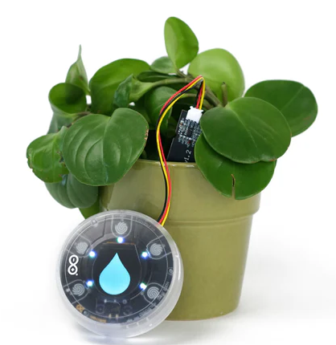
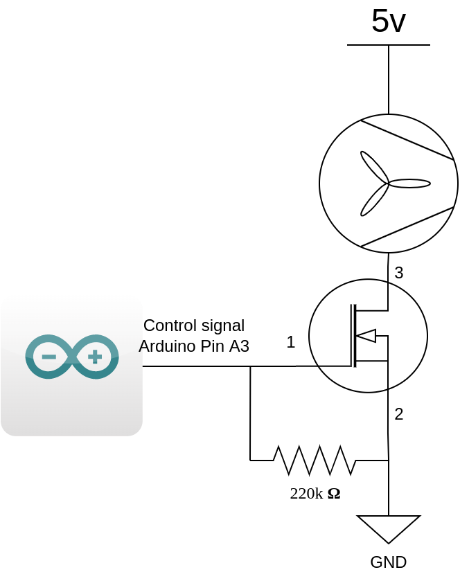
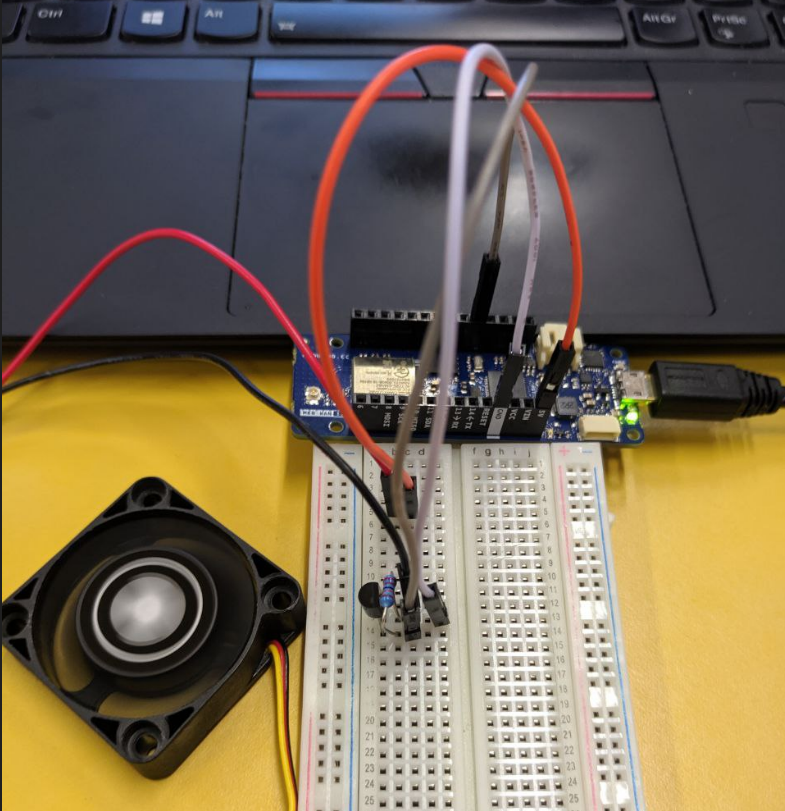
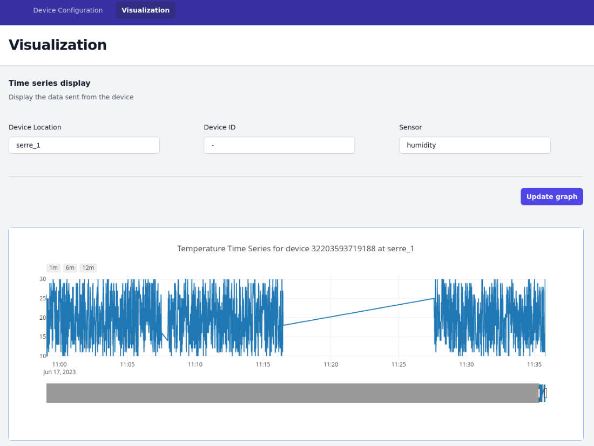

# Projet

Ce projet permet de réaliser une serre connectée. Il utilise des composants
Arduino pour prendre les mesures et Raspberry pour ingérer et afficher les
donnée. Il est possible d'y ajouter des appareils avec senseurs et actuateurs
variés qui s'inscriront et publieront automatiquement sur un broker MQTT afin
d'envoyer leur configuration (ID, liste de senseurs et actuateurs, intervalle de
mesure) ainsi que leurs mesures.

L'objectif de ce projet est de pouvoir surveiller les données environnementales
d'une serre telles que la température, l'humidité du sol et de l'air, la
luminosité ainsi que d'activer des actuateurs tels qu'un ventilateur par
exemple.

# Documentation

La documentation est disponible dans le fichier `IoT-Project-Report.pdf`

# Matériel

Nous utilisons le matériel suivant: 

- Arduino MKR Wifi 1010 : exécution du code et connectique wifi
- Arduino MKR IOT Carrier : senseurs et actuateurs
- Raspberry Pi 4b : broker MQTT, base de donnée InfluxDB, interface web de
  gestion et configuration des appareils

## Senseurs

Nous utilisons les senseurs suivants qui permettent de prendre des mesures :

- Arduino MKR IOT Carrier
    - température : HTS221
    - humidité : HTS221
    - lumière : APDS-9960
- humidité du sol : Capacitive Soil Moisture Sensor v1.2
    - connecté à l'Arduino MRK IOT Carrier

## Actuateurs

Nous utilisons un actuateur : 

- ventilateur : Xilence XPF40.W DC12v 0.05A
    - le ventilateur est connecté à un transistor mosfet qui permet de contrôler
      son alimentation via un signal envoyé depuis l'Arduino MKR Wifi 1010. Le
      mosfet utilisé est un `BF 256b` (documentation: <https://www.mouser.com/datasheet/2/149/bf256b-292516.pdf>)

{width=40%}

{width=40%}

# Logiciel

Les logiciels suivants sont utilisés :

- InfluxDB 2.71 : base de données
- Telegraf 1.26.3 : ingestion des données au format `line protocol` depuis le 
    broker MQTT vers la base de
  donnée InfluxDB
- Mosquitto 2.0.11-1 : broker MQTT
- Arduino : code arduino pour récupérer les mesures et communiquer avec le
  broker MQTT
- NodeJS 16.17.1 : serveur web d'administration
    - dépendances :
        - influxdata/influxdb-client": "^1.33.2"
        - tailwindcss/forms": "^0.5.3"
        - body-parser": "^1.20.2"
        - express": "^4.18.2"
        - express-requests-logger": "^4.0.0"
        - mqtt": "^4.3.7"
        - plotly.js": "^2.24.2"
        - tailwindcss": "^3.3.2"

{width=80%}

{width=80%}

# Architecture

Les communication entre les clients et le broker s'effectuent de la manière
suivante:

- Lorsque un arduino se connecte au réseau, il publie sa configuration initiale
  sur le topic `commander/devices/<device id>/`, ou le device id est un
  identifiant unique basé sur l'adresse MAC de l'appareil. 

  Une configuration peut ressembler à cela:
  `{"deviceUID":"32203593719188","deviceLocation":"serre_1","measurement
  interval":3000,"sensors":["humidity","temperature","light"],"actions":""}`

  Il publie également sa configuration lorsque elle vient d'être modifiée par le
  serveur web.

- Les arduino s'abonne au topic `commander/devices/<device id>/update` afin de
  recevoir les éventuelles modifications de configuration envoyées par le
  serveur web.

- Le serveur web s'abonne au topic `commander/devices/+` afin de recevoir les
  configurations de tous les client arduino.

- Le serveur web peut publier des modification de configuration pour un arduino.
  Il publie ces modifications sur le topic `commander/devices/<device
  id>/update`.

- Les arduino publie à interval régulier les informations relevées par leurs
  capteurs sur le topic `arduino`. Ces informations sont envoyées au format
  "Line Protocol".

- Le web serveur s'abonne au topic `arduino` afin de recevoir et traiter les
  informations relevées par les arduino.

Ci-dessous, un graphique de l'architecture mise en place:

